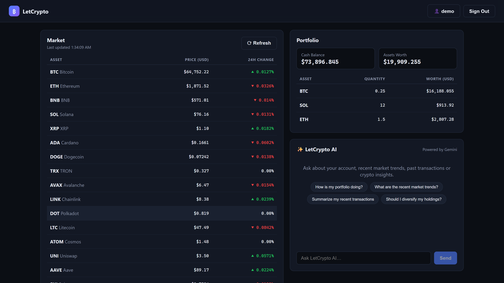
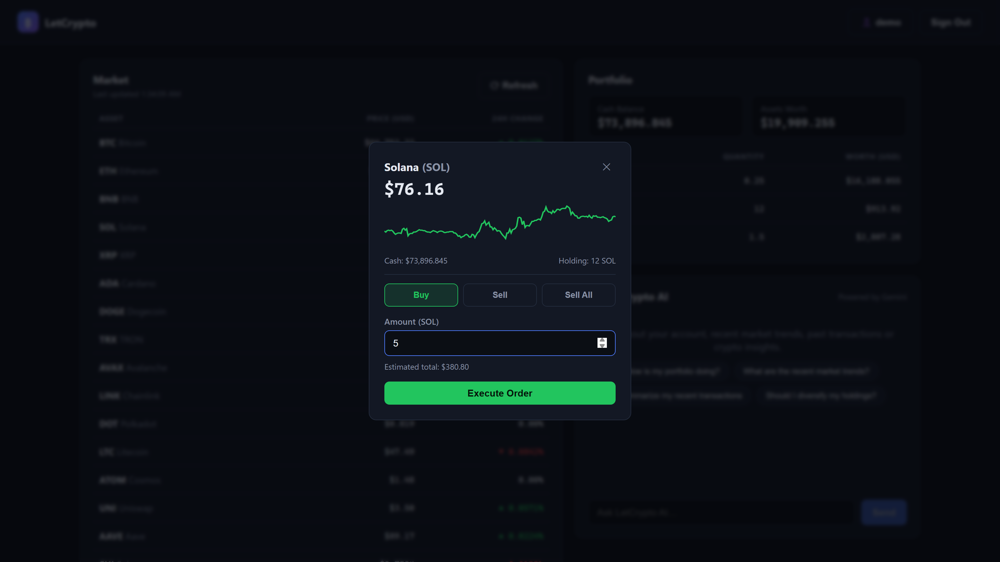
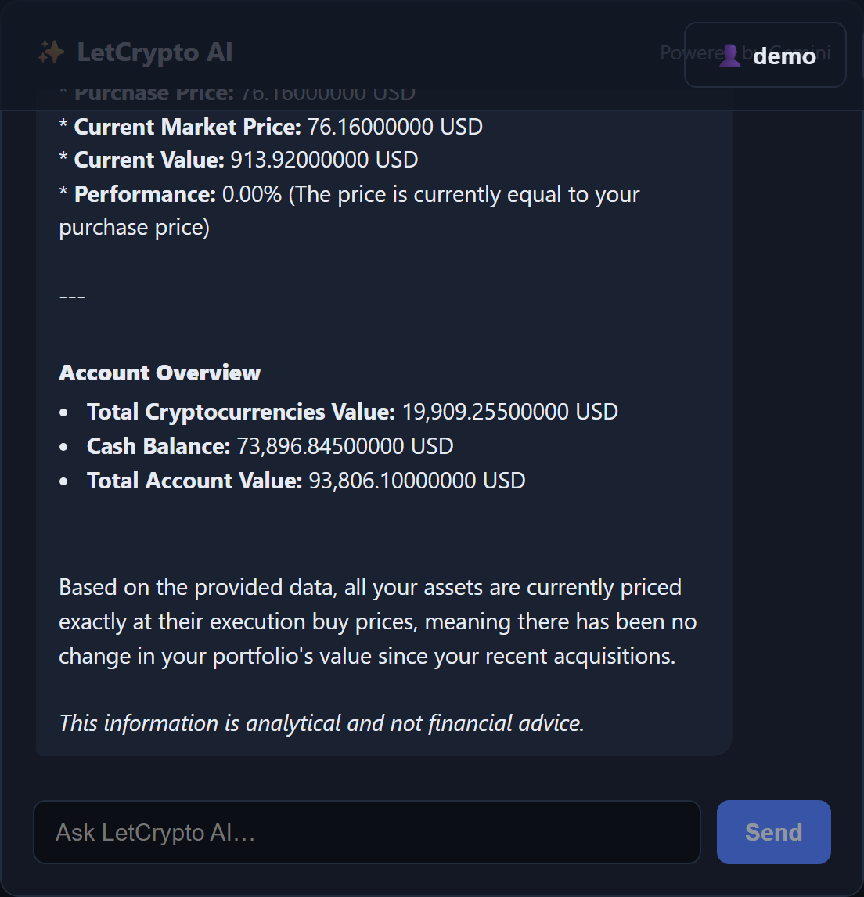
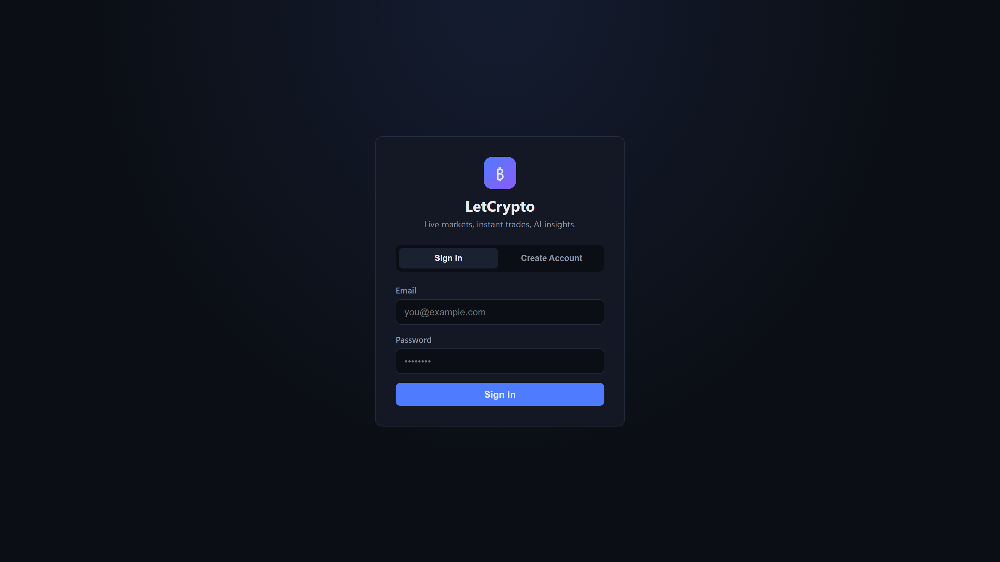
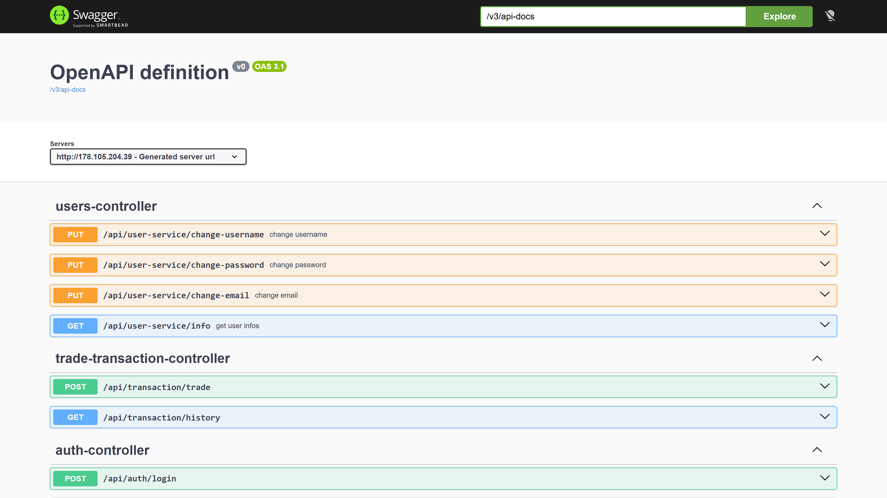
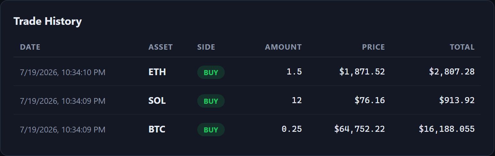
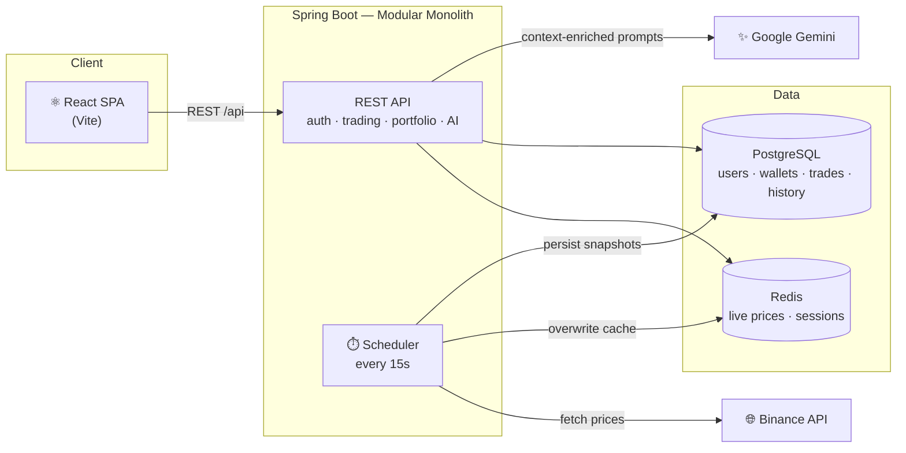

<div align="center">

# ₿ LetCrypto

**A full-stack cryptocurrency trading platform with real-time market data and AI-powered insights**

[](https://openjdk.org/)
[](https://spring.io/projects/spring-boot)
[](https://react.dev/)
[](https://www.postgresql.org/)
[](https://redis.io/)
[](https://docs.docker.com/compose/)
[](https://ai.google.dev/)

### 🌐 [Live Demo → http://178.105.204.39](http://178.105.204.39)

*Register with one click — every new account starts with a randomized cash balance, ready to trade.*



</div>

---

## ✨ Features

- 📈 **Live market data** — prices for 20 cryptocurrencies streamed from the Binance API, refreshed every 15 seconds by a background scheduler and served to clients exclusively from Redis for sub-millisecond reads
- 💸 **Real trading engine** — buy and sell with strict transactional integrity: balance updates, asset ledger changes and transaction logs either all succeed or all roll back
- 👛 **Portfolio tracking** — cash balance, holdings and live market worth, auto-refreshing alongside price updates without any UI freezes or layout shifts
- 🤖 **AI market assistant** — a Gemini-powered chat that answers questions about your account, recent transactions and market trends, fed with a context assembled on demand from PostgreSQL and Redis
- 🔐 **Session-based auth** — BCrypt-hashed credentials in PostgreSQL, session tokens cached in Redis for instant validation on every request
- ⚙️ **Account management** — change username, email and password from an in-app settings modal
- 🧾 **Full trade history** — an immutable ledger of every executed order with execution price and totals
- 📉 **Price history** — periodic snapshots persisted to PostgreSQL, rendered as sparkline charts in the trade modal

## 📸 Screenshots

| Trading — conditional Buy / Sell / Sell All with live sparkline | AI assistant — Gemini analysis of your real portfolio |
|:---:|:---:|
|  |  |

| Authentication | Swagger / OpenAPI |
|:---:|:---:|
|  |  |



## 🏗️ Architecture



**Design principles**

| Concern | Decision |
|---|---|
| Hot data (prices, sessions) | Redis only — no database reads on the polling path |
| Financial state | PostgreSQL as the single source of truth, ACID transactions, FK constraints |
| Price ingestion | `PriceProvider` interface decouples the Binance client from core logic |
| AI resilience | try/catch fallbacks — an unreachable LLM returns a clean error payload, never blocks a server thread |
| Configuration | All credentials and API keys injected via environment variables |

## 🛠️ Tech Stack

**Backend:** Java 17 · Spring Boot 4 · Spring Data JPA · Spring Security · Spring Data Redis · springdoc-openapi
**Frontend:** React 18 · Vite · vanilla CSS (dark theme)
**Data:** PostgreSQL 16 · Redis 7
**AI:** Google Gemini (`google-genai` SDK)
**Infra:** Docker Compose · nginx · systemd (production deployment on Hetzner Cloud)

## 🚀 Getting Started

### Prerequisites

Java 17+, Node.js 18+, Docker, a [Google Gemini API key](https://aistudio.google.com/apikey)

### 1 · Infrastructure

```bash
cp .env.example .env        # fill in your values
docker compose up -d        # PostgreSQL + Redis; DDL scripts in init-scripts/ run automatically
```

### 2 · Backend

Create `src/main/resources/application.properties`:

```properties
spring.application.name=i2i-academy-LetCrypto-1
spring.datasource.url=jdbc:postgresql://${POSTGRES_HOST:localhost}:${POSTGRES_PORT:5432}/${POSTGRES_DB:crypto_db}
spring.datasource.username=${POSTGRES_USER:postgres}
spring.datasource.password=${POSTGRES_PASSWORD}
spring.datasource.driver-class-name=org.postgresql.Driver
spring.jpa.hibernate.ddl-auto=validate
spring.jpa.properties.hibernate.dialect=org.hibernate.dialect.PostgreSQLDialect
spring.data.redis.host=${REDIS_HOST:localhost}
spring.data.redis.port=${REDIS_PORT:6379}
gemini.api-key=${GEMINI_API_KEY}
gemini.model=${GEMINI_MODEL:gemini-3.5-flash}
```

Then run (with `POSTGRES_PASSWORD` and `GEMINI_API_KEY` set in your environment):

```bash
./mvnw spring-boot:run      # Windows: .\mvnw.cmd spring-boot:run
```

### 3 · Frontend

```bash
cd frontend
npm install
npm run dev                 # http://localhost:5173 — proxies /api to :8080
```

## 📖 API Overview

Interactive documentation: **`/swagger-ui/index.html`** ([live](http://178.105.204.39/swagger-ui/index.html))

| Endpoint | Method | Description |
|---|---|---|
| `/api/auth/create-account` | POST | Register — assigns a randomized starting balance |
| `/api/auth/login` | POST | Login — returns a Redis-cached session token |
| `/api/asset-service/findAll` | GET | All assets with latest prices (Redis-only read) |
| `/api/transaction/trade` | POST | Execute a BUY / SELL order (transactional) |
| `/api/transaction/history` | GET | The user's full trade ledger |
| `/api/user-assets/portfolio` | GET | Cash balance and holdings with current worth |
| `/api/price-history/history` | GET | Historical price snapshots for an asset |
| `/api/user-service/info` | GET | Account info (email, username, balance) |
| `/api/user-service/change-*` | PUT | Update username / email / password |
| `/api/ai/query` | POST | Ask the Gemini-powered assistant |

Authenticated endpoints expect the session token in the `Authorization` header.

## 📁 Project Structure

```
├── src/main/java/.../          # Spring Boot modular monolith
│   ├── auth/                   #   registration & login
│   ├── users/                  #   account management
│   ├── wallets/                #   cash balances
│   ├── assets/                 #   asset catalog & price refresh
│   ├── user_assets/            #   holdings ledger
│   ├── trade_transaction/      #   order execution & history
│   ├── price_history/          #   persisted price snapshots
│   ├── ai_query_logs/          #   Gemini integration & prompt building
│   ├── provider/               #   Binance price provider (PriceProvider interface)
│   ├── redis/                  #   session & price cache services
│   └── schedular/              #   15-second background price worker
├── frontend/                   # React SPA (Vite)
├── init-scripts/               # PostgreSQL DDL + seed data (auto-run by Docker)
└── docker-compose.yml          # One-command local infrastructure
```

---

<div align="center">

*Built as part of the **i2i Academy** Java Spring bootcamp.*

</div>
